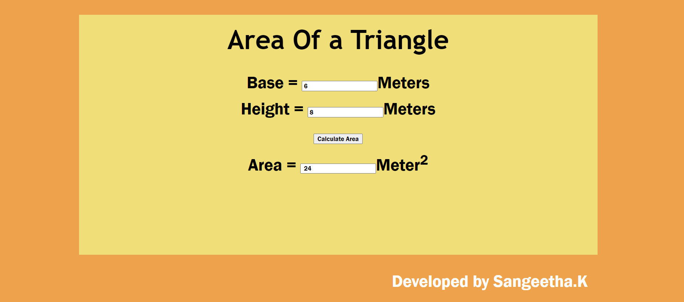

# Web Page for Mathematical Calculations

## AIM:

To design a static website with validation to perform mathematical calculations in client side.

## DESIGN STEPS:

### Step 1:

Requirement collection.

### Step 2:

Creating the layout using HTML and CSS.

### Step 3:

Write javascript to perform the calculations.

### Step 4:

Include regularexpression based input validation.

### Step 5:

Validate the layout in various browsers.

### Step 6:

Validate the HTML code.

### Step 6:

Publish the website in the given URL.

## PROGRAM :
```
<!DOCTYPE html>
<html lang="en">
<head>
    <meta charset="UTF-8">
    <meta http-equiv="X-UA-Compatible" content="IE=edge">
    <meta name="viewport" content="width=device-width, initial-scale=1.0">
    <title>Mathematical Calculation</title>
    <style>
        * {
            box-sizing: border-box;
            font-family: 'Franklin Gothic Medium', 'Arial Narrow', Arial, sans-serif;
        }
        body {
            background-color:rgb(238, 162, 75);
        }
        .container {
            width: 1080px;
            margin-left: auto;
            margin-right: auto;
        }
        .box1{
            width: 500px;
            margin-left: auto;
            margin-right: auto;
            height: 500px; 
        }
        .content {
            display: block;
            width: 100%;
            background-color: rgb(240, 222, 120);
            margin-top: 50px;
            min-height: 500px;
        }
        .content1 {
            display: block;
            width: 100%;
            background-color:rgb(240, 222, 120);
            margin-top: 30px;
            min-height: 500px;
        }
        h1{
            text-align: center;
            font-family: 'Trebuchet MS', 'Lucida Sans Unicode', 'Lucida Grande', 'Lucida Sans', Arial, sans-serif;
            padding-top: 20px;
            font-size: 55px;
        }
        .formelement{
            text-align: center;
            padding-bottom: 15px;
            font-family: 'Franklin Gothic Medium', 'Arial Narrow', Arial, sans-serif;
            font-size: 35px;
        }
        .footer{
            text-align: right;
            padding-right:20px;
            color:white;
            font-size: 35px
        }

    </style>
</head>
<body>
    <div class="container">
        <div class="content">
            <div class="box1">
              <h1>Volume of Rectangle</h1>
              <form>
                  <div class="formelement">
                    <lable for="radiusedit">Length:</lable>
                    <input type="text" id="lengthedit" value="0"/>Meters
                  </div>
                  <div class="formelement">
                    <lable for="heightedit">Height:</lable>
                    <input type="text" id="heightedit" value="0"/>Meters
                  </div>
                  <div class="formelement">
                    <lable for="heightedit">Width:</lable>
                    <input type="text" id="widthedit" value="0"/>Meters
                  </div>
                  <div class="formelement">
                    <input type="button" value="Calculate Volume" id="valbutton"/>
                  </div>
                  <div class="formelement">
                    <lable for="volumeedit">Volume:</lable>
                    <input type="text" id="volumeedit"  readonly />Meter<sup>3</sup>
                  </div>
                  <div class="formelement">
                  </div>
                </form>
            </div>
           
        </div>
    </div>
   <script type="text/javascript">
          var button;
          button=document.querySelector("#valbutton");
          button.addEventListener("click",function(){
            
              var lengthtext,heighttext,widthtext,volumetext;
              var lval,hval,wval,vval;
    
              lengthtext=document.querySelector("#lengthedit");
              heighttext=document.querySelector("#heightedit");
              widthtext=document.querySelector("#widthedit");
              volumetext=document.querySelector("#volumeedit");

              rexp=new RegExp("^[1-9]+[0-9]*$");

              lval=lengthtext.value;
              r1=lval.match(rexp);
              hval=heighttext.value;
              r2=hval.match(rexp);
              wval=widthtext.value;
              r3=wval.match(rexp);
              

        if(r1==null)
        {
            alert("Please Enter Positive Integers Only for length");
        }
        if(r2==null)
        {
            alert("Please Enter Positive Integers Only for Height");
        }
        if(r3==null)
        {
            alert("Please Enter Positive Integers Only for Weight");
        }
        
          vval=lval*hval*wval
          volumetext.value=""+vval
    
    });
</script>   
    <div class="container">
        <div class="content1">
            <div class="box1">
                <h1>Area Of a Triangle</h1>
                <form>
                   <div class="formelement">
                        <label for="dedit" >Base  =</label>
                        <input type="text" id="dedit" value="0"/>Meters
                    </div> 
                    <div class="formelement">
                        <label for="eedit">Height =</label>
                        <input type="text" id="eedit" value="0"/>Meters
                    </div>
                    <div class="formelement">
                         <input type="button" value="Calculate Area" id="addbuttons"/>
                    </div>
                    <div class="formelement">
                        <label for="fedit">Area =</label>
                        <input type="text" id="fedit" value="0" readonly />Meter<sup>2</sup>
                    </div>
                    
                </form>
            </div>
           
        </div>
        <div class="footer">
        <p>Developed by Sangeetha.K</p>
        </div>
    </div>

<script>
  var button;
  button=document.querySelector("#addbuttons");
  button.addEventListener("click",function(){
      var dtext,etext,ftext;
      var dval,eval,fval;
 
      dtext=document.querySelector("#dedit");
      etext=document.querySelector("#eedit");
      ftext=document.querySelector("#fedit");

      rexp=new RegExp("^[1-9]+[0-9]*$");

      dval=dtext.value;
      r3=dval.match(rexp);
      eval=etext.value;
      r4=eval.match(rexp)

      if(r3==null)
      {
         alert("Please Enter Positive Integers Only for Base");
      }
      if(r4==null)
      {
         alert("Please Enter Positive Integers Only for Height");
      }
      fval=1/2*eval*dval;
      ftext.value=" "+fval;
  });
  
</script>    


</body>
</html>
```

## OUTPUT:



## Result:

Thus a website is designed to perform mathematical calculations in the client side.
